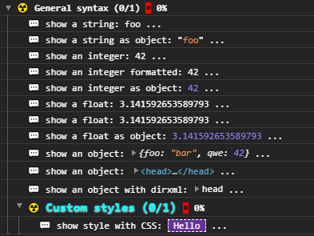
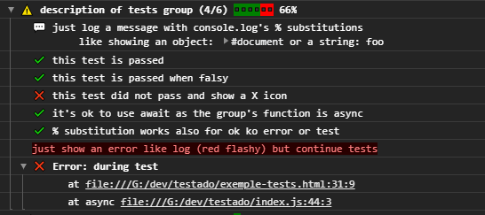
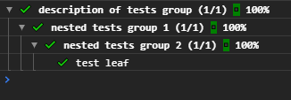

# testado
Simple test runner, with async and icons.

#### Meaning of "testado"
"testado" is Esperanto and translated to English means testing.

## Usage

### browser

Create an HTML document and insert this `<script>` tag:

```html
<script src="https://unpkg.org/skdlfjslkfjs"></script>
<script>
/* Your tests here */
</script>
```

### nodejs
⚠️ not tested

`npm install --save-dev testado`

```javascript
require('testado')
/* Your tests here */
```
or
```javascript
import 'testado'
/* Your tests here */
```

## Tests syntax

### General syntax

**testado** works heavily on template strings and tag functions, so obvioulsy it should run in an environment supporting this...   
Even if you can "fake" template calls by providing 2 arrays (see [non template string calls](#non-template-string-calls)).

```javascript
tag `string` ( ...content... )
```
Each tag function returns a function (exception are noticed), so you have to give arguments in parenthesis.
The string provided is a **full template and can use substitutions**, but these substitution are transformed into the **C-like syntax** ('foo %s bar %o qwe') and given to the console's corresponding method (see [Using string substitutions](https://developer.mozilla.org/en-US/docs/Web/API/console#Using_string_substitutions)).  
This means that you have to give the type letter after each template string substitutions:

Notice the type letter in `${}s`, `${}d`, `${}f` or `${}o`, this indicates the console how to render the given subsituted thing:

```javascript
log `show a string: ${'foo'}s ...`
log `show a string as object: ${'foo'}o ...`
log `show an integer: ${42.5}i ...`
log `show an integer formatted: ${42.5}.5d ...`  // 📣 Note: Precision formatting doesn't work in Chrome
log `show an integer as object: ${42}o ...`
log `show a float: ${Math.PI}f ...`
log `show a float: ${Math.PI}.2f ...`  // 📣 Note: Precision formatting doesn't work in Chrome
log `show a float as object: ${Math.PI}o ...`
log `show an object: ${{foo:'bar',qwe: 42}}o ...`
log `show an object: ${document.head}o ...`
log `show an object with dirxml: ${document.head}O ...`
```

Console CSS can be used with `${}c` containing a CSS string. Insert a CSS substitution with an empty string to reset styles:

```javascript
test `${'font-size:1.3em;text-shadow:0 1px 2px white; color:cyan'}cCustom styles` ( ({log})=> {
	log `show style with CSS: ${'border:1px dashed; background:rebeccapurple'}c Hello ${''}c ...`
})
```

This will give you in the console:  



### `test`
The 1st and only tag accessible from your script root is `test`:

```javascript
test `description of tests group` ( Function )
```
The function given to `test` can be async (it's treated async by default), and will receive an object you can destructure to get the subsequent tag functions.  
⚠️ it's important to always get fresh nested tags to maintain hierarchy (see [nesting test groups](#nesting-test-groups))

```javascript
test `description of tests group` ( async ({ok,ko,log,error})=> {

	log `just log a message with console.log's % substitutions 
	like showing an object: ${document}o or a string: ${"foo"}s`
	
	ok `this test is passed` ( true )
	ko `this test is passed when falsy` ( false )
	
	ok `it's ok to use await as the group's function is async` ( await true )
	
	ok `% substitution works also for ${ok}o ${ko}o ${error}o or ${test}o` ( true )
	
	error `just show an error like log (red flashy) but continue tests`
	
	// if real Error is throw during tests, it's collected and shown in the result, but
	// subsequent tests are not played
	throw new Error('during test')
	
	ok `not played test` ( false )
})
```


### Nesting test groups

You can nest `test` in `test` by destructuring a fresh new tag function for this level of nesting.
To preserve the nesting hierachy of the resulting groups you **MUST** use a `test` tag from nested function's arguments:


```javascript
test `description of tests group` ( async ({test})=> {
	                                      ^
	         ____________________________/ 
	        /
	       v
	await test `nested tests group 1` ( async ({test})=> {
		                                    ^
		         __________________________/ 
		        /
		       v
		await test `nested tests group 2` ( async ({ok})=> {

			ok `test leaf` ( true )
		
		})
	
	})
	
})
```


### non template string calls
☢️ @TODO write docs